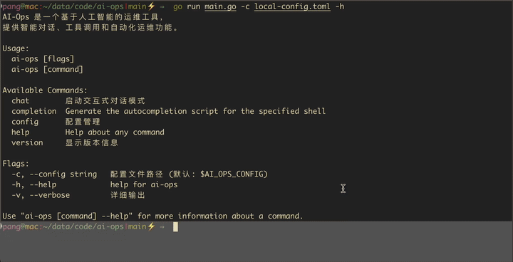

# AI-Ops

AI-Ops 是一个基于 Go 的智能运维命令行工具，聚合大语言模型（LLM）能力与自动化运维场景，助力高效、智能的运维对话与工具调用。

---


## ✨ 主要功能

- **对话式运维**：通过命令行与 AI 进行自然语言交互，支持多轮上下文。
- **智能工具调用**：AI 可根据对话内容自动调用插件工具，完成如天气查询、监控、自动化脚本等任务。
- **多模型支持**：可无缝切换 OpenAI、Gemini 等主流大模型。
- **工具扩展能力**：支持自定义 Go 插件，轻松扩展工具能力。

---
## 功能演示

向 AI 询问问题，并自动调用工具查询天气，调用 RAG 知识库召回数据。



---
## 🛠️ 内置与可扩展工具

AI-Ops 内置了多种常用工具，AI 可在对话中自动调用：

- **echo**：回显测试工具，主要用于插件开发调试。
- **weather**：天气查询工具，支持自然语言提问如“北京天气怎么样”。
- **RAG**：知识检索增强（Retrieval Augmented Generation），可用于文档问答等。

你可以根据实际需求，参考示例快速开发并注册自定义工具插件，AI 会自动识别和调用。

> **工具扩展说明**：
>
> - 所有工具均以插件形式注册，开发者可在 `internal/tools/plugins/` 目录下添加新工具。
> - 只需实现标准接口并注册，AI 即可在对话中自动发现和调用。
> - 详细开发教程见 [docs/插件开发.md](docs/插件开发.md) 或 `weather_tool.go` 示例。

---

## 🚀 使用指南

1. **启动对话**

   ```bash
   ./ai-ops chat
   ```

2. **与 AI 交互**

   - 直接输入你的问题或需求，AI 会自动理解并回复。
   - 如需调用工具（如天气、监控等），直接用自然语言描述即可。

   示例：
   ```
   > 今天北京天气怎么样？
   AI 正在思考...
   AI 正在调用工具: weather({"location":"北京"})
   ...
   北京市当前天气为晴，气温25℃，体感温度26℃，微风。
   ```

3. **退出对话**

   输入 `exit` 或 `quit` 即可安全退出。

---

## 📚 文档与扩展

- **详细安装、配置与插件开发说明请参见 [docs/](docs/)**
- 你可以在 `docs/` 目录下找到：
  - 安装与环境配置指南
  - 配置文件说明
  - 插件开发教程与示例
  - 常见问题解答

---

## 🗂️ 项目结构概览

```
.
├── cmd/         # 命令行入口
├── internal/    # 核心逻辑与插件
├── main.go      # 程序主入口
└── config.toml  # 主配置文件
```

---

## 📄 开源许可

本项目基于 [MIT License](LICENSE) 开源。
